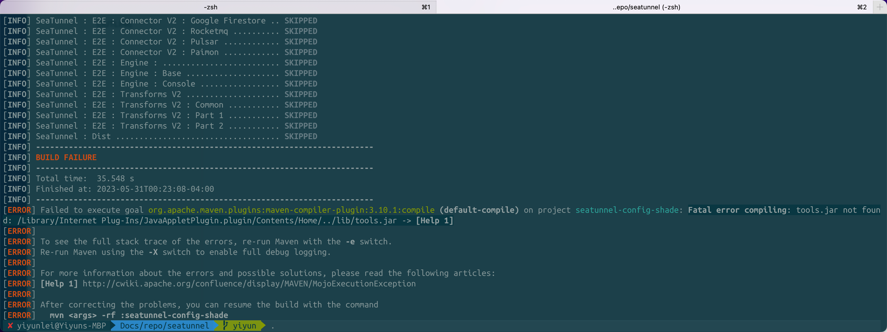
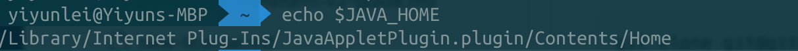
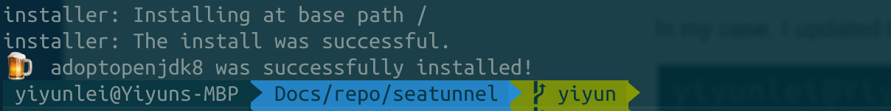
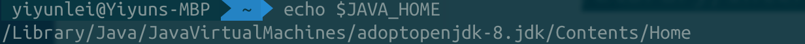
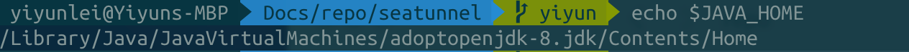

[ERROR] Failed to execute goal org.apache.maven.plugins:maven-compiler-plugin:3.10.1:compile (default-compile) on project seatunnel-config-shade: Fatal error compiling: tools.jar not found: /Library/Internet Plug-Ins/JavaAppletPlugin.plugin/Contents/Home/../lib/tools.jar -> [Help 1]

Solution: set $JAVA_HOME correctly

Follow: https://stackoverflow.com/a/67618805/18517831

In my case, I updated the ~/.zshrc file.

## Install Java SDK8 for MacOS M1 and set JAVA_HOME

https://stackoverflow.com/a/64987486/18517831

[How to install Java 8 on Mac](https://stackoverflow.com/questions/24342886/how-to-install-java-8-on-mac)

https://stackoverflow.com/a/65891462/18517831

